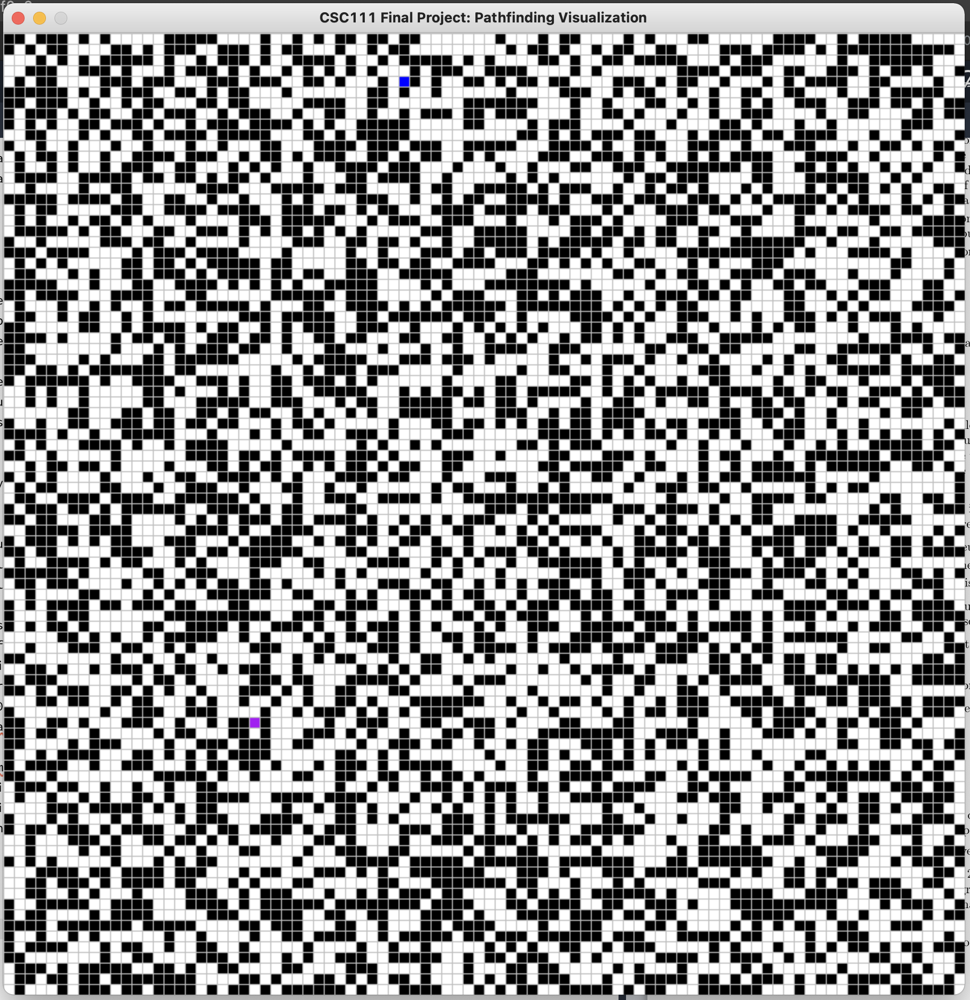
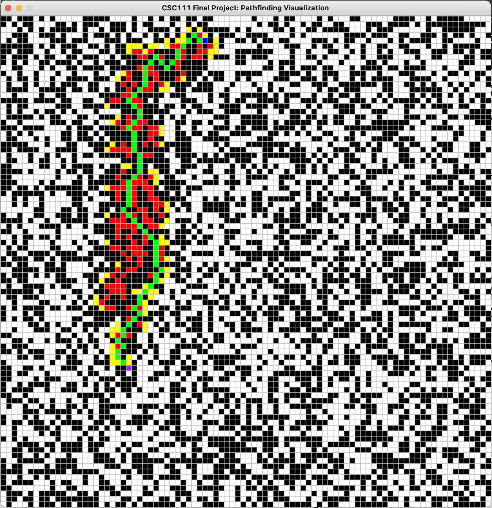

# A-Star-Pathfinding

## Problem Description ##

A maze is a network of paths and obstacles that culminate in a final destination. Traversing a maze is difficult
because of dead-ends and obstacles. In our project we will be simplifying the layout of a maze into nodes and
attempting to use a traversal algorithm to find the shortest route to complete the maze. By simplifying the
junctions and paths of a maze into nodes, we will be able to use our knowledge of graphs to traverse the maze.
Due to the scale of the maze, the shortest route will no longer be apparent to the human eye, which is where
the algorithm will come in. We will try to visually show the maze and the proposed path that our algorithm
will generate.
After our research stage we felt as a group that the A* search algorithm would be the most efficient way to
traverse our randomly generated mazes. The specifics of the algorithm we go into in the computational plan,
but it works by minimizing a Cost function , f(x), so that the traversal is always in the direction of the end goal.
Finding the shortest distance between two nodes has applications beyond maze traversal. The nodes could be
used to represent junctions in a city, the algorithm would then show the route to a destination that passes
through the fewest junctions. The nodes could be used to represent flight connections, the algorithm would
then show the fewest number of connections between two destinations, potentially saving time and money for
travelers. If expanded to social media it could show the degrees of separation between people on the platform
and could be used to visualize the six degrees of separation theory (Wikipedia). The flexibility of the possible
solution is the reason why we chose this goal. Although we are only creating the visualization for a maze, the
actual traversal algorithm has many more uses and would only have to be slightly altered to represent different
scenarios.

## Research Question ##

**How can we determine and visualize the shortest route between two different points? For
example, the shortest path out of a maze?**

## Instructions ##

* Only Python (version 3.9) is required.
* The libraries/modules we will be using are (all pure Python):
    * pytest
    * python-ta
    * pygame
* To run our project, only the main.py file needs to be run. When it is run, a pygame window should pop up
with black and white squares. This is our maze map - the black squares represent walls and the white squares
are traversable. You should also be able to see a single blue square and a single purple square. The goal of our
program is to find the shortest possible route between the start point (blue square) to the end point (purple
square).
* There are three heuristics that we have implemented in out program and either of these three can be used to
find the shortest path. To recap, the three heuristics are the Manhattan, Pythagorean and Diagonal heuristics.
    * Press ’M’ to use the Manhattan heuristic in the total cost function.
    * Press ’P’ to use the Pythagorean heuristic in the total cost function.
    * Press ’D’ to use the Diagonal heuristic in the total cost function.
* At the end, the shortest path found should be represented by green squares. In the case that no path is found,
the program will end with every single searched square filled red.
* Once a path is found (or not), you can try a new heuristic or even clear the path and generate a new maze.
    * To clear all paths, press ’C’.
    * To generate a new random maze, press ’R’
* As long as all the modules in the requirements.txt file are installed, the file works perfectly in new projects on
any new Windows, MacOS, or Linux machine.

Below I have included the visualization of the initial state and the final state of the pygame window.

